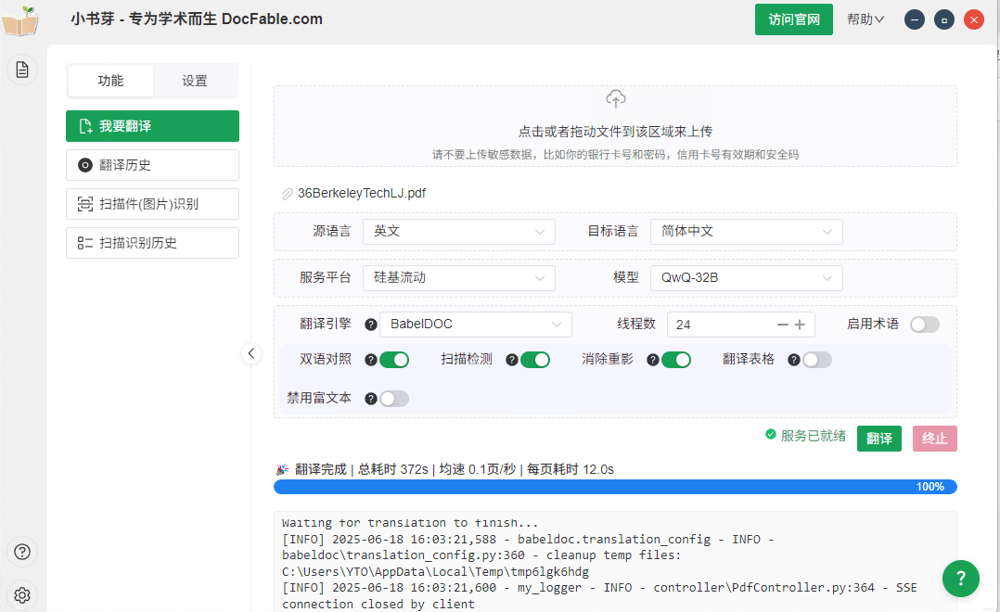
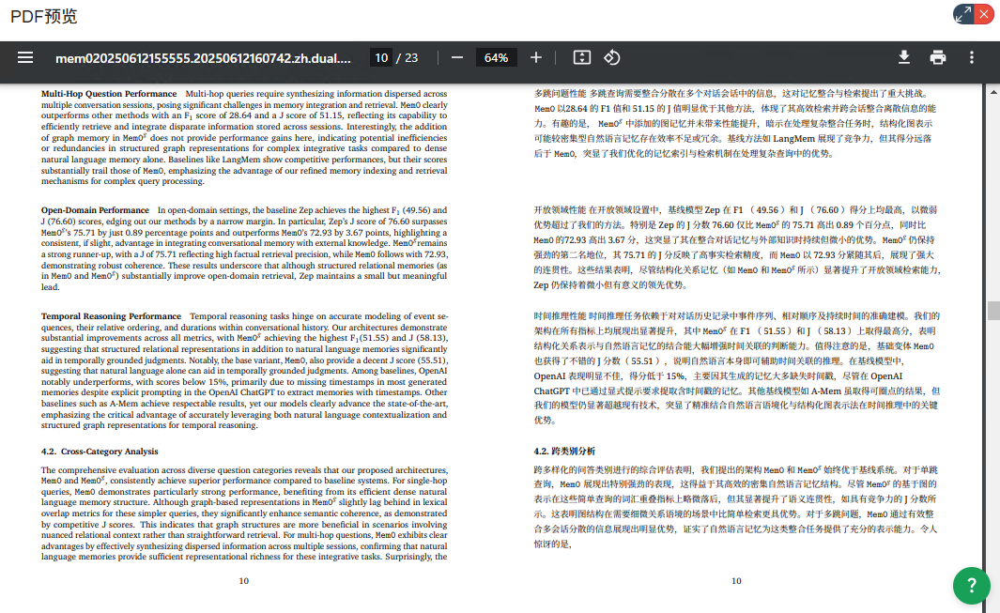

# 小书芽 - PDF翻译工具
小书芽原名字节立方。
更新主力在gitcode上，github的更新会有延迟   
- [小书芽在gitcode的地址](https://gitcode.com/songbinsky/bytecubpdf)
## 环境要求
- **操作系统**: Windows 10/11 64位
- **Python**: 3.11.9 (推荐使用Miniconda管理环境)
- **Node.js**: 20.9.0 (推荐使用nvm管理版本)

## 安装指南

### 1. 后端服务配置
```bash
# 进入插件目录
cd bytecub-plugin

# 编译Python为可执行文件
python build_exe.py
```

### 2. 前端开发环境
```bash
# 安装依赖
npm install

# 启动开发服务器
npm run dev
```

## 生产环境打包
```bash
# 完整打包(包含前后端)
npm run build
```

## 快速开始
1. 双击运行 `小书芽.exe`
2. 首次启动需等待服务初始化(约1-3分钟)
3. 主界面加载完成后即可使用

## 常见问题
### 环境验证
```bash
# 验证Python版本
python --version

# 验证Node.js版本 
node --version
```

### 依赖安装问题
```bash
# 清除缓存后重试
npm store prune
npm install --force
```

### 防火墙设置
首次运行时请允许程序通过防火墙，以确保网络功能正常。

## 下载
最新版本可从官网下载:  
[小书芽下载中心](https://www.docfable.com/docs/introduction/download.html)

## 致谢
本项目基于以下开源项目二次开发:
- [PDFMathTranslate](https://github.com/Byaidu/PDFMathTranslate)
- [BabelDOC](https://github.com/funstory-ai/BabelDOC)

感谢原作者的杰出贡献！
## 界面截图

 




```