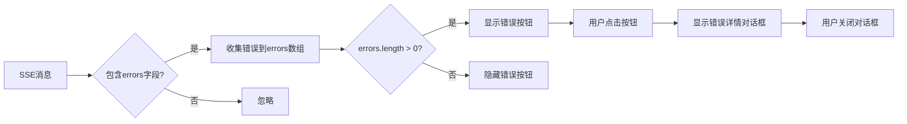

# 技术设计: SSE翻译错误监控与展示

## 1. 架构概述

### 1.1 系统集成
该功能将集成到现有的 PDF 翻译流程中，主要在 `PdfTsMain.vue` 组件内实现。通过监控 SSE 流中的 `errors` 字段，实时收集错误信息并展示给用户。

### 1.2 组件架构

```
PdfTsMain.vue (主组件)
├── 状态管理 (PdfTranslateStore)
│   └── 新增: errors (string[])
├── SSE 消息处理
│   └── onmessage 回调中监控 errors 字段
├── 错误按钮 (NButton)
│   ├── 显示条件: errors.length > 0
│   ├── 样式: 红色 + 错误图标 + 数量
│   └── 位置: 翻译按钮左侧
└── 错误详情对话框 (NModal)
    └── 显示所有错误消息列表
```

### 1.3 数据流



## 2. 数据模型/接口设计

### 2.1 Store 状态扩展

**文件:** `src/renderer/stores/modules/PdfTranslateStore.ts`

```typescript
state: () => ({
  // 现有状态...
  errors: [] as string[]  // 新增: 存储错误消息列表
})

actions: {
  // 新增动作
  addErrors(errorMessages: string[]) {
    this.errors.push(...errorMessages)
  }
  clearErrors() {
    this.errors = []
  }
}
```

### 2.2 SSE 消息格式

现有 SSE 消息格式:
```json
{
  "status": "processing",
  "progress": 12,
  "stage": "Parse Page Layout",
  "current_page": 1,
  "total_pages": 1,
  "core": "babeldoc",
  "msg": "正在处理部分 1/1",
  "errors": ["错误消息1", "错误消息2"]
}
```

### 2.3 错误对话框数据结构

```typescript
interface ErrorDialogState {
  show: boolean  // 对话框显示状态
  title: string  // 对话框标题: "翻译错误详情"
  errors: string[]  // 错误消息列表
}
```

## 3. 关键组件与测试策略

### 3.1 组件分解

#### 3.1.1 状态管理 (PdfTranslateStore)
**职责:**
- 维护错误消息列表状态
- 提供添加和清除错误的操作方法

**修改内容:**
- 在 `state` 中添加 `errors` 字段
- 在 `actions` 中添加 `addErrors` 和 `clearErrors` 方法

#### 3.1.2 SSE 消息处理 (PdfTsMain.vue)
**职责:**
- 在 `fetchEventSource` 的 `onmessage` 回调中监控 `errors` 字段
- 当检测到错误时调用 store 的 `addErrors` 方法

**修改内容:**
```typescript
onmessage(event) {
  const data = JSON.parse(event.data);
  
  // 新增: 处理错误信息
  if (data.errors && Array.isArray(data.errors) && data.errors.length > 0) {
    store.addErrors(data.errors);
  }
  
  // 现有逻辑...
}
```

#### 3.1.3 错误按钮 (PdfTsMain.vue - Template)
**职责:**
- 显示/隐藏错误按钮
- 显示错误数量
- 点击后打开错误详情对话框

**实现方式:**
```vue
<n-button
  v-if="errors.length > 0"
  type="error"
  size="small"
  @click="showErrorDialog = true"
>
  <template #icon>
    <n-icon><WarningIcon /></n-icon>
  </template>
  错误 ({{ errors.length }})
</n-button>
```

#### 3.1.4 错误详情对话框 (PdfTsMain.vue - Template)
**职责:**
- 显示所有错误消息的模态对话框
- 提供关闭功能

**实现方式:**
```vue
<n-modal v-model:show="showErrorDialog">
  <n-card
    title="翻译错误详情"
    style="width: 600px; max-height: 500px;"
    :bordered="false"
    size="huge"
    role="dialog"
    aria-modal="true"
  >
    <n-scrollbar style="max-height: 400px;">
      <div v-if="errors.length > 0">
        <div class="error-summary">共 {{ errors.length }} 条错误</div>
        <n-list hoverable clickable>
          <n-list-item v-for="(error, index) in errors" :key="index">
            <n-text type="error">{{ index + 1 }}. {{ error }}</n-text>
          </n-list-item>
        </n-list>
      </div>
      <n-empty v-else description="暂无错误信息" />
    </n-scrollbar>
    <template #footer>
      <n-space justify="end">
        <n-button @click="showErrorDialog = false">关闭</n-button>
      </n-space>
    </template>
  </n-card>
</n-modal>
```

#### 3.1.5 错误状态生命周期管理 (PdfTsMain.vue)
**职责:**
- 在开始新翻译时清除错误
- 在文件变化时清除错误

**修改位置:**
1. `handleTranslate` 函数开始时调用 `store.clearErrors()`
2. `handleFileChange` 函数中调用 `store.clearErrors()`

### 3.2 UI/UX 设计规范

#### 3.2.1 错误按钮样式
- **类型:** `type="error"` (红色)
- **尺寸:** `size="small"` (与翻译按钮一致)
- **图标:** 使用 Naive UI 的警告图标
- **位置:** 翻译按钮左侧，在同一 `n-flex justify="end"` 容器内

#### 3.2.2 错误对话框样式
- **宽度:** 600px
- **最大高度:** 500px
- **可滚动区域:** 最大高度 400px
- **错误项样式:** 红色文本，带编号

#### 3.2.3 图标选择
使用 Naive UI 内置图标:
```typescript
import { AlertCircle } from '@vicons/ionicons5'
```

### 3.3 测试策略

#### 3.3.1 单元测试重点
- Store 的 `addErrors` 方法正确添加错误到数组
- Store 的 `clearErrors` 方法正确清空错误数组
- 错误按钮的显示/隐藏逻辑正确响应 `errors.length` 变化

#### 3.3.2 集成测试重点
- SSE 消息包含 `errors` 字段时，错误被正确收集
- 开始新翻译时，之前的错误被正确清除
- 文件变化时，错误被正确清除
- 错误按钮点击能正确打开对话框
- 对话框显示所有错误信息

#### 3.3.3 手动测试场景
1. **场景1:** 翻译过程中出现错误
   - 预期: 错误按钮立即显示，显示正确数量
   
2. **场景2:** 翻译完成后有错误
   - 预期: 错误按钮继续保持显示
   
3. **场景3:** 点击错误按钮
   - 预期: 对话框打开，显示所有错误详情
   
4. **场景4:** 开始新翻译
   - 预期: 之前的错误被清除
   
5. **场景5:** 翻译无错误
   - 预期: 错误按钮不显示

### 3.4 依赖分析

**新增依赖:**
- 无新增外部依赖

**现有依赖使用:**
- `naive-ui` 组件库: NButton, NModal, NCard, NList, NListItem, NText, NSpace, NScrollbar, NEmpty, NIcon
- `@vicons/ionicons5`: AlertCircle 图标
- `pinia`: Store 状态管理

### 3.5 性能考虑

- 错误列表可能较长，使用虚拟滚动或分页（如超过100条）
- 对话框使用懒加载，仅在点击时渲染
- 错误消息存储在内存中，不持久化到数据库

### 3.6 可访问性

- 错误按钮具有明确的文本标签
- 对话框使用 `role="dialog"` 和 `aria-modal="true"` 属性
- 错误信息使用对比度高的颜色（红色文本）
- 支持键盘操作（ESC 关闭对话框）
